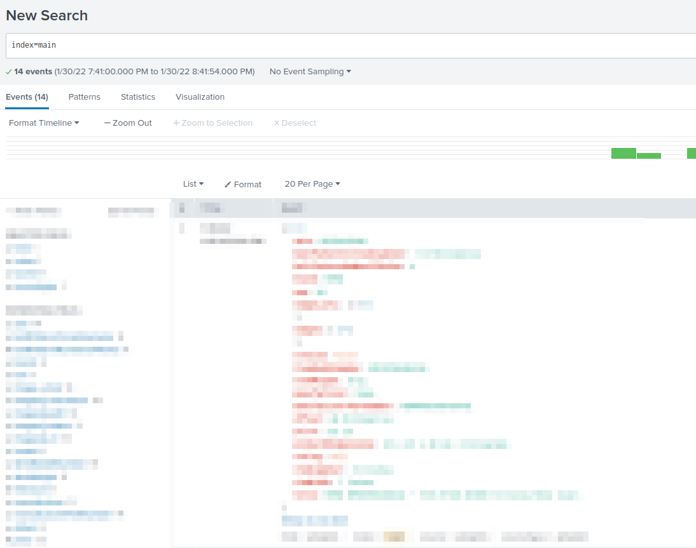

# What is this
A pipeline to write Scrapy results to Splunk using HTTP Event Collector (HEC) interface

# Dependencies
Python Class for Sending Events to Splunk HTTP Event Collectordeveloped by George Starcher
https://github.com/georgestarcher/Splunk-Class-httpevent

```
$ pip install Splunk-HEC
```


# Install
The pipeline can be stored a dedicated pipelines folder under your Scrapy project. You'll need to place add an empty __init__.py in the folder to make Python treat the directories as containing packages;

```
cd your_scraper_folder
mkdir pipelines
cd pipelines
touch __init__.py
wget
```


# Configure
Add index, token and url configurations to settings.py
These need to be created on your receiving Splunk instance.
```
SPLUNK_URL = '1.2.3.4'
SPLUNK_HEC_TOKEN = 'obfuscated-eb10-46b7-b3ab-12345678910'
SPLUNK_INDEX = 'main'
```

Add the pipeline to settings.py
```
ITEM_PIPELINES = {
   'scrapy.pipelines.images.ImagesPipeline': 100,
   'yourscraper.pipelines.splunksend.SplunkSend': 400
}
```

# Run
Run your scraper and results will be forwarded to Splunk


# Troubleshooting
Can the scraper connect to Splunk ?

```
$ curl -k https://1.2.3.4:8088/services/collector/health
{"text":"HEC is healthy","code":17
```
